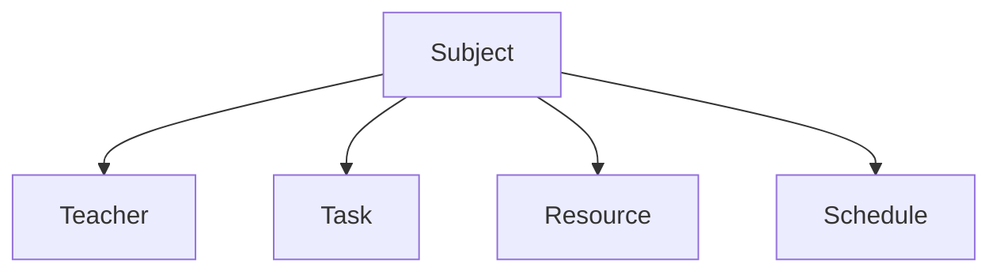

# CC-Dash

A dashboard for managing the course resources.

## Goals

The main goal is to make a easy to use platform for managing resources in the course.

Technologies that I want to use whilst developing this project:

**Back-end:**

1. Django
2. GraphQL

**Front-end:**

1. React
2. TailwindCSS
3. NextJS
4. Apollo

## Overview

High level view over the database structure.

